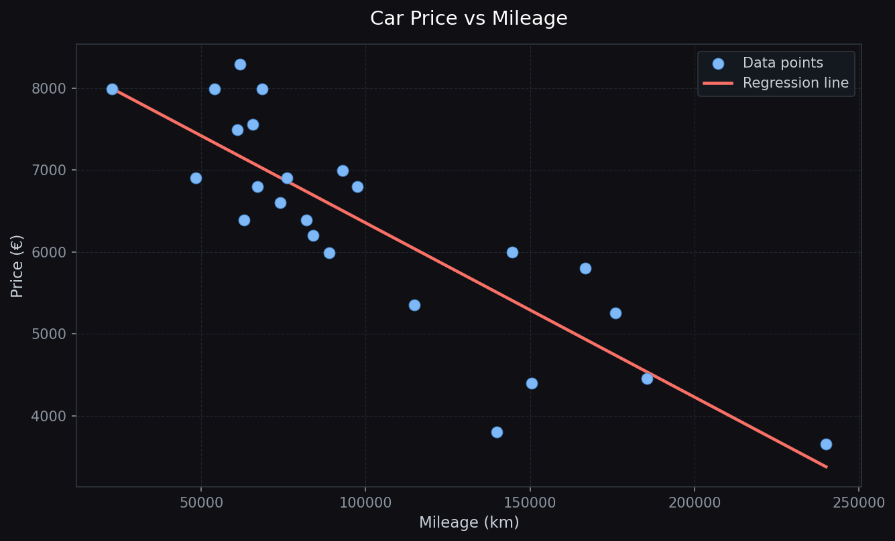
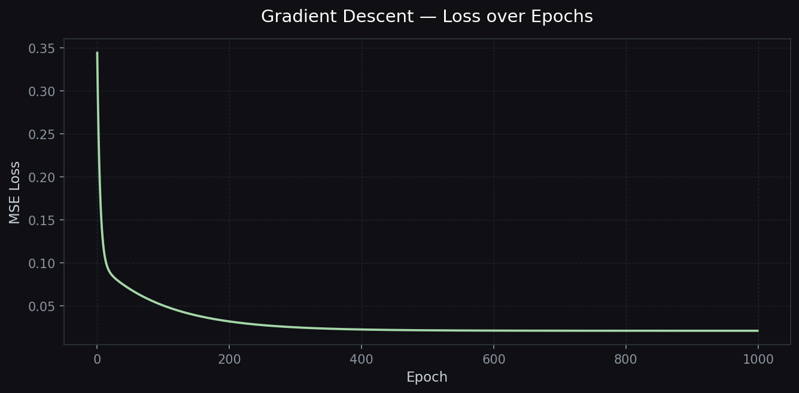

# ft_linear_regression

A linear regression implementation from scratch — predicts car prices from mileage using gradient descent, with no ML libraries involved.

---

## How it works

The model fits a line `price = θ₀ + θ₁ × km` through the data. Training normalizes the inputs, runs gradient descent for 1000 epochs, then denormalizes the resulting parameters back to real-world scale.

### Regression line



### Loss over training



The loss drops fast in the first ~100 epochs and flattens out once the model has converged.

### Precision

The trained model reaches an **R² of 73.29%** on the provided dataset.

---

## Usage

**1. Train**

```bash
python3 src/train.py src/data.csv
```

Reads `km` and `price` columns from the CSV, runs gradient descent, and writes `model.json`.

**2. Predict**

```bash
python3 src/predict.py
# → Please enter a mileage: 80000
# → The estimated price of your car is : 6778
```

Loads `model.json` (falls back to `θ₀=0, θ₁=0` if not found) and returns a price estimate.

**3. Plot**

```bash
python3 src/plot.py src/data.csv [model.json]
```

Opens an interactive scatter plot with the regression line overlaid.

**4. Precision**

```bash
python3 src/precision.py src/data.csv [model.json]
```

Prints the R² score of the model against the dataset.

---

## Files

```
src/
├── train.py      — gradient descent, normalization, saves model.json
├── predict.py    — loads model, estimates price for a given mileage
├── plot.py       — scatter + regression line visualization
├── precision.py  — R² metric
└── data.csv      — 24 car records (km, price)
```

---

## Install

```bash
pip install -r requirements.txt
```
